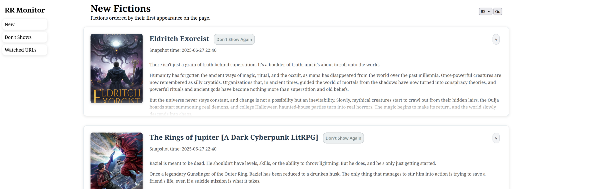
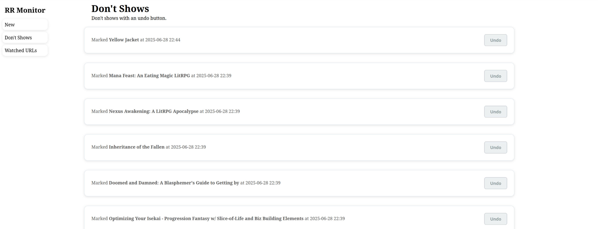
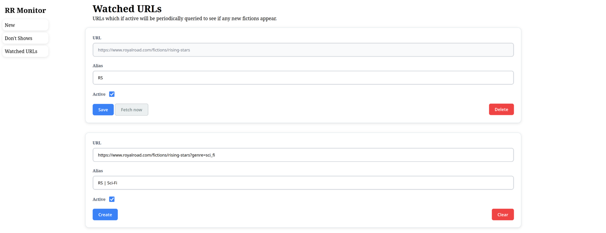

# Royal Road Monitor 

This tool monitors [Royal Road](https://www.royalroad.com/fictions/rising-stars) pages, periodically checking if new fictions have appeared on the page. It's designed to be hosted in portainer via docker compose, but can be run in the command line for just trying it out / development. 

## Usage

The main page displays fictions that have appeared on the page ordered by their first appearance, ex. if a new fiction appears in the url it will appear first in the list. 
You can click the "Don't Show Again" buttons to hide fictions.

|  |
|:-----------------------------------------------:|
|                    main page                    |

If you accidentally clicked on "Don't Show Again" you can go to the "Don't Shows" page to unmark the fiction. 

|  |
|:-------------------------------------------------------------:|
|                       watched urls page                       |


The "Watched URLs" page allows adding more pages to be monitored. 
You can click the "Fetch Now" button to check if any new fictions have appeared on the page. 
However, clicking the button creates a snapshot of the page in the database so don't spam the button as it will take up memory. 

|  |
|:-----------------------------------------------------------------:|
|                         watched urls page                         |

## Trying It Out / Local Development

To try the site out without, clone this github repo and install and run it via pip. 

```bash
git clone git@github.com:LokiLin14/royal-road-monitor.git
cd royal-road-monitor

# Create a virtual environment to not mess up the global environment
python -m venv .venv
source ./.venv/bin/activate 

# Install packages and run the application 
pip install -e . 
flask --app royal_road_monitor run --debug
```

Note, this setup will not automatically check the Royal Road for new fictions. 
You must manually click the "Fetch Now" button in the "Watched URLs" page. 

## Full Setup - Setting up Portainer 

In portainer navigate to stacks and create a new stack. 

1. Copy the [docker compose yaml](https://github.com/LokiLin14/royal-road-monitor/blob/main/deployment/compose.yaml) into the web editor.
2. Download this [stack.env file](https://github.com/LokiLin14/royal-road-monitor/blob/main/deployment/stack.env).
3. Set the `FLASK_CRON_KEY` in the stack.env file to some secret alphanumeric string. 
Consider using `openssl rand -hex 32` to generate the string.
Then upload the stack.env file into portainer.
4. Deploy the stack. 

The website should now be visible on port 5000 of your portainer machine. 